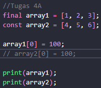
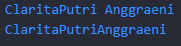

# KUIS 1
## Nama : Clarita Putri Anggraeni
## Kelas : TI-3G
## NIM : 2141720213

### SOAL 1

Jawab : 
- untuk menampilkan tulisan Hello world

### SOAL 2

Jawab : 
- pada soal terdapat variabel "name" dengan tipe data "string" yang memiliki value "Clarita Putri Anggraeni", lalu akan di print sebanyak 3 kali karena ada 3 print. Maka hasilnya akan menampilkan "Clarita Putri Anggraeni" sebanyak 3 kali

### SOAL 3

Jawab : pada soal terdapat 2 variabel yaitu :
- "firstName", tipe data "String" dengan value "Clarita". Variabel ini dapat diubah nilainya selama program berjalan karena bertipe data "String".
- "lastName", variabel ini adalah deklarasi variabel "lastName" yang juga bertipe data "String", tetapi diberi kata kunci "final". Dengan kata kunci "final", variabel ini dinyatakan sebagai konstan, yang berarti nilai 'Putri Anggraeni' tidak dapat diubah setelah inisialisasi. 

Lalu di print variabel "firstName" untuk menampilkan value dari varibel tersebut yaitu akan menampilkan "Clarita". Serta di print juga untuk variabel "lastName" untuk menampilkan value dari variabel tersebut yaitu akan menampilkan "Putri Anggraeni".

### SOAL 4A

Jawab :
- Mendeklarasikan variabel "array1" sebagai variabel "final", yang berarti tidak dapat mengganti referensi "array1", tetapi Anda dapat mengubah isi dari array tersebut.
- Mendeklarasikan variabel "array2" sebagai variabel "const", yang berarti tidak dapat mengubah baik referensi "array2" maupun isi dari array tersebut. 
- "array1[0] = 100;", maksud dari kode tersebut mengganti nilai pada indeks 0 dari "array1" dari 1 menjadi 100.
- "array2[0] = 100;", mmaksud dari kode tersebut mengganti nilai pada indeks 0 dari array2 dari 4 menjadi 100. Namun, kode tersebut jika dijalankan akan terjadi error dibagian ini, karena variabel const, yang berarti tidak dapat mengubah baik referensi array2 maupun isi dari array tersebut. Untuk pembenarannya dihilangkan kode tersebut, supaya nanti jika mengeprint array2 akan menampilkan hasilnya.
- "print(array1);", maksud dari kode itu mengeprint/meanmpilkan value variabel array1. Maka hasilny akan menampilkan 100, 2, 3. Pada index 0 dari value 1 menjadi 100 karena sudah diganti.
- "print(array2);", maksud dari kode tersebut menampilkan value dari variabel array2. Sehingga akan menghasilkan 4,5,6.

### SOAL 4B

Jawab: 
- "int number1 = 100;",  ini mendeklarasikan variabel "number1" sebagai tipe data integer (bilangan bulat) dan memberikan nilai 100. Variabel "number1" akan menyimpan bilangan bulat 100.
- "double number2 = 100.5;", ini mendeklarasikan variabel "number2" sebagai tipe data dou"ble (bilangan desimal) dan memberikan nilai 100.5. Variabel "number2" akan menyimpan bilangan desimal 100.5.
- "print(number1);", Ini mencetak nilai dari "number1". Hasil cetaknya akan menjadi 100.
- "print(number2);", Ini mencetak nilai dari "number2". Hasil cetaknya akan menjadi 100.5

### SOAL 5

Jawab:
- "num number = 10;", Ini mendeklarasikan variabel num"ber sebagai tipe data "num" dan memberikan nilai awal 10. Tipe data "num" dalam Dart adalah tipe data numerik yang dapat digunakan untuk menyimpan baik bilangan bulat (integer) maupun bilangan desimal (double).
- "print(number);", ini mencetak nilai dari "number". Hasil cetak pertama akan menjadi 10 karena pada awalnya number memiliki nilai 10.
- "number = 10.5;", ini mencoba mengganti nilai dari number menjadi 10.5, yang merupakan bilangan desimal. Di sini mencoba mengganti tipe data "num" yang sebelumnya berisi bilangan bulat (integer) menjadi bilangan desimal (double). Namun, dalam banyak bahasa pemrograman, mengganti tipe data variabel seperti ini biasanya akan menghasilkan kesalahan. Dalam Dart, mungkin akan mendapatkan kesalahan kompilasi karena mencoba mengubah tipe data dari int menjadi double. Jika ingin menghindari kesalahan ini, harus mendeklarasikan number sebagai double dari awal.

### SOAL 6

Jawab: 
- "String firstName = 'Clarita';", ini mendeklarasikan variabel "firstName" dengan tipe data "String" dan memberikan nilai 'Clarita' kepadanya.
- "String LastName = 'Putri Anggraeni';", ini mendeklarasikan variabel "LastName" dengan tipe data "String" (perhatikan bahwa 'LastName' dalam kode seharusnya 'lastName' dengan huruf kecil sebagai praktik yang baik dalam penamaan variabel) dan memberikan nilai 'Putri Anggraeni' kepadanya.
- "var fullName = '$firstName ${LastName}';", ini mendeklarasikan variabel "fullName" dengan kata kunci var, menggunakan string interpolation (penyisipan string) dengan tanda $ dan ${} untuk menggabungkan nilai dari firstName dan LastName ke dalam fullName. Hasil dari penggabungan ini adalah 'Clarita Putri Anggraeni'.
- "print(fullName);", ini mencetak nilai dari fullName ke konsol. Hasil cetaknya akan menjadi "Clarita Putri Anggraeni"

### SOAL 7

jawab: 
Dalam string 'ini \'OPTIMAL\' \$sekali', kita dapat melihat beberapa penggunaan karakter escape:
- \ Ini adalah karakter escape yang digunakan untuk menambahkan tanda kutip tunggal ke dalam string yang didefinisikan dengan tanda kutip tunggal. Ini menghasilkan tanda kutip tunggal yang akan dicetak dalam string.
- \$ Ini adalah karakter escape yang digunakan untuk menambahkan karakter dollar sign $ ke dalam string tanpa mengaktifkan interpolasi string. Dengan karakter escape ini, $ akan dicetak sebagai karakter literal dan bukan sebagai indikator interpolasi.
- Jika di print akan menghasilkan : ini 'OPTIMAL' $sekali.

### SOAL 8

Jawab: 
Pada soal 8 ada yang kurang yaitu mendeklarasikan variable firstName dan lastName, sehingga ditambahkan :
- "String firstName = 'Clarita';",ini mendeklarasikan variabel "firstName" dengan tipe data "String" dan memberikan nilai 'Clarita'.
- "String lastName = 'Putri Anggraeni';", ini mendeklarasikan variabel "lastName" dengan tipe data "String" dan memberikan nilai 'Putri Anggraeni'.

Penjelasan kode selanjutnya :
- "var name1 = firstName + lastName;", Ini mendeklarasikan variabel "name1" dan menggabungkan nilai dari variabel "firstName" dan "lastName" menggunakan operator +. Hasilnya adalah penggabungan dua string menjadi satu.
- "var name2 = 'Clarita' 'Putri' 'Anggraeni';" Ini mendeklarasikan variabel "name2" dan menggabungkan tiga string secara langsung tanpa menggunakan operator penggabungan. Ini disebut dengan literasi string yang dilanjutkan (string literal concatenation). Dalam hal ini, semua string yang ditemukan berdekatan akan digabungkan menjadi satu.
- "print(name1);", akan menampilkan 'ClaritaPutri Anggraeni'
- "print(name2);", akan menampilkan 'ClaritaPutriAnggraeni'

### SOAL 9

Jawab:
- "var name1 = firstName + " " + lastName;", Ini mendeklarasikan variabel name1 dan menggabungkan nilai dari variabel firstName dan lastName dengan menggunakan operator + untuk menambahkan spasi antara nama depan dan nama belakang. Hasilnya adalah penggabungan dua string dengan spasi di antara mereka.
- "var name2 = 'Clarita' ' Putri' ' Anggraeni';", Ini mendeklarasikan variabel name2 dan menggunakan literasi string yang berdekatan untuk menggabungkan tiga string menjadi satu. Dart akan secara otomatis menggabungkan string-string yang berdekatan dalam satu literasi string.
- "print(name1);", ini akan menampilkan 'Clarita Putri Anggraeni'
- "print(name2);", ini akan menampilkan 'Clarita Putri Anggraeni'

### SOAL 10

Jawab :
- "var kalimat_panjang = ''' ... ''';", ini adalah cara mendefinisikan string multi-baris dalam Dart dengan menggunakan tanda kutip tiga (''' atau """). String multi-baris memungkinkan untuk menulis teks dalam beberapa baris tanpa harus menggunakan karakter escape seperti \n (untuk karakter newline).
- "print(kalimat_panjang);", ini mencetak isi dari variabel kalimat_panjang ke konsol. Maka akan menampilkan 'ini saya punya proyek dart banyak'.

