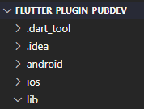
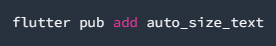
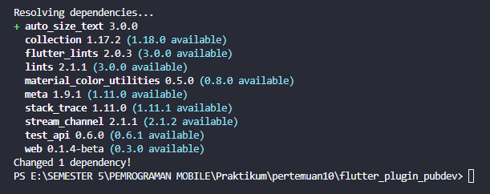
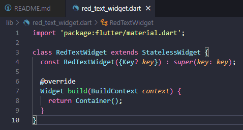
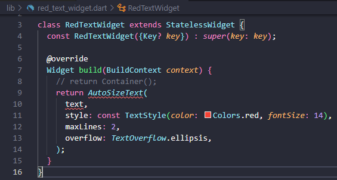
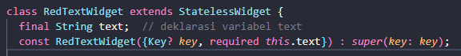
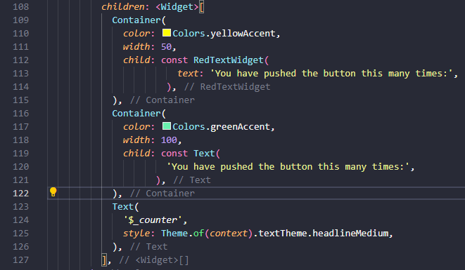
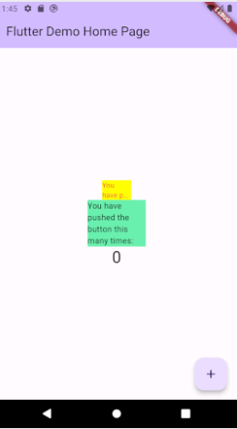

# Praktikum Manajemen Plugin
## Nama : Clarita Putri Anggraeni
## Kelas : TI-3G
## NIM : 2141720213
### Github : https://github.com/claarr/flutter/tree/main/pertemuan10/flutter_plugin_pubdev

### Langkah 1 : Buat Project Baru
Buatlah sebuah project flutter baru dengan nama flutter_plugin_pubdev. Lalu jadikan repository di GitHub Anda dengan nama flutter_plugin_pubdev.

### Langkah 2 : Menambahkan Plugin
Tambahkan plugin auto_size_text menggunakan perintah berikut di terminal

### Langkah 3 : Buat file red_text_widget.dart
Buat file baru bernama red_text_widget.dart di dalam folder lib lalu isi kode seperti berikut.

### Langkah 4 : Tambah Widget AutoSizeText
Masih di file red_text_widget.dart, untuk menggunakan plugin auto_size_text, ubahlah kode return Container() menjadi seperti berikut.

Setelah Anda menambahkan kode di atas, Anda akan mendapatkan info error. Mengapa demikian? Jelaskan dalam laporan praktikum Anda!
Jawab : karena dengan mencoba menggunakan variabel text dalam widget AutoSizeText, tetapi tidak mendefinisikan atau menginisialisasi variabel text di dalam kelas RedTextWidget. Oleh karena itu, Flutter tidak dapat menemukan variabel text yang dicoba gunakan, sehingga menghasilkan kesalahan. Sehingga perlu menginisialisasi variabel text di dalam kelas RedTextWidget atau memberikan nilai yang sesuai saat membuat instance dari kelas ini.

### Langkah 5 : Buat Variabel text dan parameter di constructor
Tambahkan variabel text dan parameter di constructor seperti berikut.

### Langkah 6 : Tambahkan Widget di main.dart
Buka file main.dart lalu tambahkan di dalam children: pada class _MyHomePageState

Run aplikasi tersebut dengan tekan F5, maka hasilnya akan seperti berikut.

## Tugas Praktikum
1. Selesaikan Praktikum Menerapkan Plugin di Project Flutter diatas, lalu dokumentasikan dan push ke repository Anda berupa screenshot hasil pekerjaan beserta penjelasannya di file README.md!

2. Jelaskan maksud dari langkah 2 pada praktikum tersebut!
Jawab : langkah ini adalah instruksi untuk menambahkan plugin bernama auto_size_text ke dalam proyek Flutter. Plugin ini digunakan untuk membuat teks yang dapat menyesuaikan ukuran secara otomatis sesuai dengan lebar dan tinggi yang tersedia. Dengan cara ini, dapat menghindari teks yang terlalu besar atau terlalu kecil untuk kotak yang menampilkannya.

3. Jelaskan maksud dari langkah 5 pada praktikum tersebut!
Jawab : langkah ini menambahkan sebuah variabel bernama text ke dalam kelas RedTextWidget dan mengatur konstruktor kelas tersebut untuk menerima parameter text saat membuat instance dari kelas tersebut.
- final String text;: Ini adalah deklarasi variabel text yang ditambahkan ke dalam kelas RedTextWidget. Variabel ini akan digunakan untuk menyimpan teks yang akan ditampilkan oleh widget ini. Variabel ini diberi tipe String, yang berarti variabel text hanya dapat menyimpan nilai-nilai yang merupakan teks.
- const RedTextWidget({Key? key, required this.text}): Ini adalah deklarasi konstruktor kelas RedTextWidget. Konstruktor ini menerima dua parameter opsional. Parameter pertama, key, adalah parameter yang digunakan untuk memberikan kunci unik ke widget (biasanya digunakan dalam kasus pembaruan widget). Parameter kedua, text, adalah parameter yang diberi tanda "required," yang berarti setiap kali membuat instance dari RedTextWidget, wajib menyediakan nilai untuk parameter text.

4. Pada langkah 6 terdapat dua widget yang ditambahkan, jelaskan fungsi dan perbedaannya!
Jawab : langkah ini menambahkan dua widget Container yang berbeda bersama dengan kontennya, yaitu RedTextWidget dan Text. 
- Container dengan RedTextWidget : container ini menggunakan RedTextWidget sebagai kontennya. RedTextWidget adalah widget yang telah didefinisikan sebelumnya, dan menerima parameter text. Dalam contoh ini, memberikan teks "You have pushed the button this many times:" ke dalam RedTextWidget.
- Container dengan Text : container ini menggunakan widget bawaan Flutter Text sebagai kontennya. Text adalah widget sederhana yang digunakan untuk menampilkan teks statis. Memberikan teks yang sama, "You have pushed the button this many times:", ke dalam Text.

Jadi, perbedaan utama antara keduanya adalah bahwa RedTextWidget adalah widget yang didefinisikan sendiri dan memberikan lebih banyak kontrol atas penampilan teks, sementara Text adalah widget bawaan Flutter yang digunakan untuk menampilkan teks statis dengan konfigurasi yang lebih sederhana.

5. Jelaskan maksud dari tiap parameter yang ada di dalam plugin auto_size_text berdasarkan tautan pada dokumentasi ini !
Jawab : 
- key* = Jelaskan maksud dari tiap parameter yang ada di dalam plugin auto_size_text berdasarkan tautan pada dokumentasi ini !
Jawab : 
- key* =  Kunci unik (identifier) untuk widget AutoSizeText. Ini berguna untuk mengidentifikasi widget ini secara unik dalam pohon widget.
- textKey = Kunci yang diberikan untuk teks yang akan ditampilkan. Digunakan untuk mengidentifikasi teks secara unik dalam konteks widget ini.
- style* = Gaya teks yang digunakan untuk mengatur tampilan teks, termasuk warna, ukuran font, dan atribut lainnya.
- minFontSize = Ukuran font minimum yang akan digunakan untuk teks. Ini memastikan bahwa teks tidak akan lebih kecil dari ukuran ini bahkan jika teks sangat panjang.
- maxFontSize = Ukuran font maksimum yang digunakan untuk teks. Ini memastikan bahwa teks tidak akan lebih besar dari ukuran ini.
- stepGranularity =  Langkah kenaikan atau penurunan ukuran font saat menyesuaikan teks. Ini memungkinkan untuk mengatur seberapa halus perubahan ukuran font saat teks beradaptasi.
- presetFontSizes = Daftar ukuran font yang tersedia untuk digunakan saat menyesuaikan teks.
- group = Kelompok yang digunakan untuk mengontrol ukuran font bersama-sama dalam satu kelompok. Misalnya, Anda dapat memiliki beberapa widget AutoSizeText dalam satu grup sehingga ukuran font mereka akan disesuaikan bersama-sama.
- textAlign* = Penyelarasan teks dalam widget, seperti kiri, kanan, tengah, atau kanan-ke-kiri.
- textDirection* = Arah teks, seperti dari kiri ke kanan (LTR) atau dari kanan ke kiri (RTL).
- locale* = Konfigurasi bahasa dan negara untuk teks. Ini mempengaruhi cara teks ditampilkan dan format numerik.
- softWrap* = Menentukan apakah teks dapat mematahkan baris (soft wrap) atau harus diatur dalam satu baris.
- wrapWords = Menentukan apakah kata-kata dalam teks dapat mematahkan baris.
- overflow* = Cara menangani teks jika melebihi ukuran yang tersedia. Pilihan meliputi ellipsis (tanda titik-titik), fade (memudar), atau clip (memotong).
- overflowReplacement = Widget yang digunakan sebagai pengganti jika teks melebihi ruang yang tersedia.
- textScaleFactor* = Faktor skalasi ukuran teks yang memungkinkan pengubahan ukuran font teks secara keseluruhan.
- maxLines = Jumlah maksimum baris yang dapat ditampilkan dalam teks. Jika terlampaui, akan diterapkan tindakan overflow yang ditentukan.
- semanticsLabel =  Label semantik yang digunakan untuk aksesibilitas, membantu pengguna dengan berbagai kebutuhan aksesibilitas memahami konten teks dengan benar.

6. Kumpulkan laporan praktikum Anda berupa link repository GitHub melalui Assignment ini !
